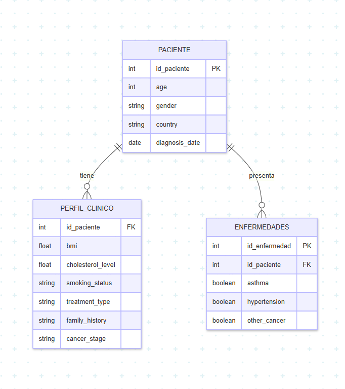

# Tarea 3

## Modelo Relacional de la Base de Datos

La base de datos se adapto siendo separada en 3 secciones distintas como se vió en la tarea 2.

### Esquema del Modelo Relacional

- **Paciente**
    - id_paciente **(PK)**
    - age
    - gender
    - country
    - diagnosis_date

- **Perfil Clínico**
    - id_paciente **(FK)**
    - bmi
    - cholestrol_level
    - smoking_status
    - treatment_type
    - family_history
    - cancer_stage

- ¨**Enfermedades**
    - id_enfermedad **(PK)**
    - id_paciente **(FK)**
    - asthma 
    - hypertension
    - other_cancer

### Diagrama Relacional

