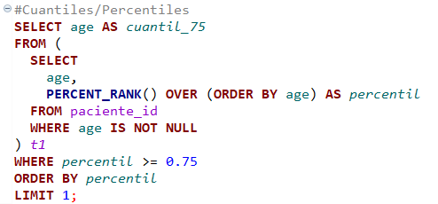

# Tarea 6

## Funciones de Agragación
En esta tarea, se mostraran diferentes querys que permiten agrupar nuestras tablas de la base de datos para tener mayor conocimiento estadistico sobre las mismas.

### Conteo de frecuencias
**Conteo del numero de pacientes por pais.**

El resultado nos indica que el país con mas pacientes es Suiza con 33,161 registros.

**Media por edad de los nacidos en Suiza.**

El resultado fue: 55.0157.

### Mínimos y máximos.

**La edad mas alta y mas baja de mi tabla de pacientes**

La edad mínima fue de 4 años y la edad máxima de 104 años.

### Cuantil 75%

El resultado fue de 63.

### Moda

    

El resultado fue 55.

### Hallazgos y dificultades.

**Dificultades**
    - Sinceramente no supe como hacer la moda y el cuartil, tuve que apoyarme de la tarea de un compañero y aun así no fue tan facil entender la lógica, pero gracias a ese apoyo me funcionó.
    - No fue una dificultad, pero si noté que a mi computadora le costaba correr el query, en algunos casos tardaba alrededor de 15 segundos.

**Hallazgos**

### Para esta tarea se utilizó la herramienta **Mockaroo.com**