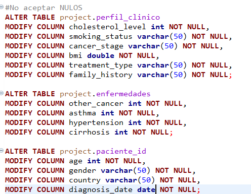
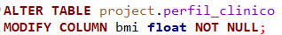
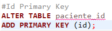
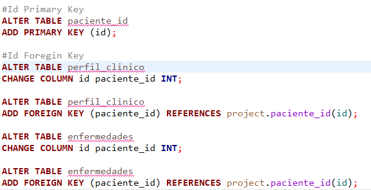

# Tarea 7

## Modificaciones en la base

Tuve suerte que no encontra algun valor nulo dentro de mi pase, por lo tanto hice pequeñas modificaciones

### No aceptar nulos

Mis tablas aceptan valores nulos, cosa que no debe de ser posible así que modifique las características de mis tablas y sus variables para no aceptar dichos valores.

### Formato double

En la tabla perfil_clinico, la columna bmi tiene formato double, lo cambie a float ya que el doble puede afectar la memoria y la verdad es que no ocupo tanta presición en esa columna.

### Id como Primary Key

### Id como Foregein Key

