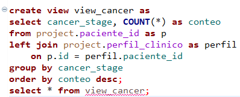
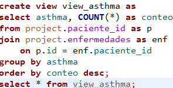
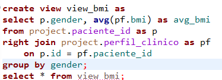
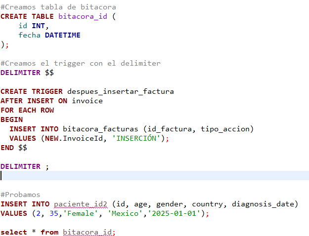

# Tarea 8

## Crear Views (vistas) recurrentes del usuario.

### View con JOIN

Conteo de los pacientes con diferentes etapas del cancer.

**Resultado**
| cancer_stage | conteo |
|--------------|--------|
| Stage III    |222,594 |
| Stage IV     |222,527 |
| Stage I      |222,516 |
| Stage II     |222,363 |

### View con LEFT JOIN
Ver de todo mi conjunto, cuantos tienen asthma y tener una idea si el asthma está relacionado al cancer

**Resultado**
|      asthma    | conteo |
|----------------|--------|
| With Asthma    |471,931 |
| Without Asthma |418,069 |

### View con Right Join
Quiero observar el promedio de BMI de las mujeres y hombres.

| gender | avg_bmi|
|--------|--------|
| Male   | 30.4983 |
| Female | 30.4899 |

## Crear un trigger

